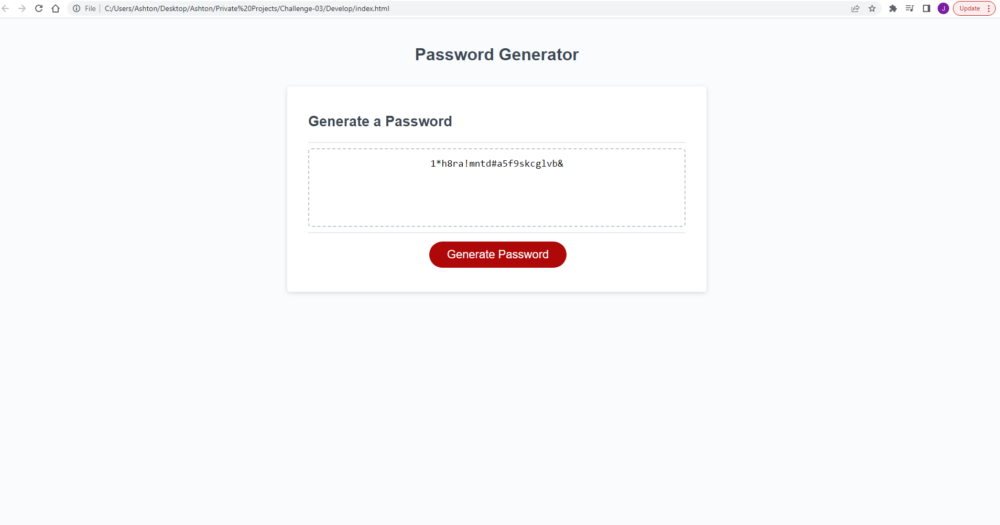
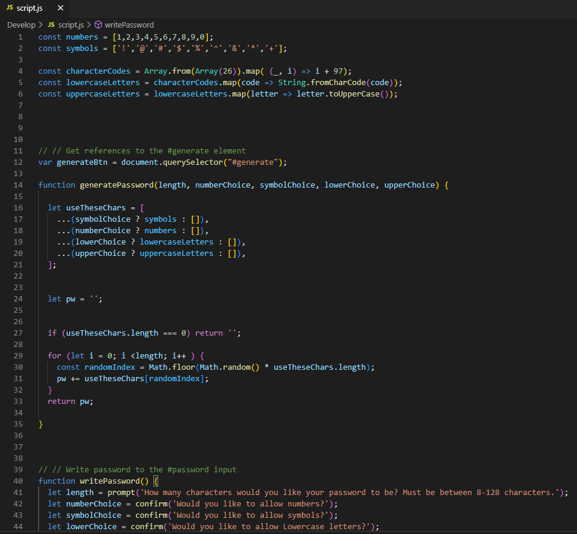
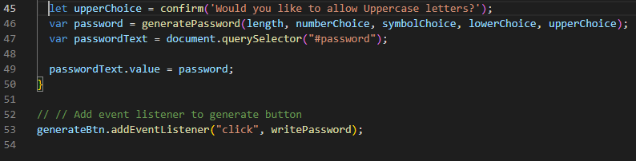

# Challenge-03 Random Password Generator

## Description

This challenge assignment provided the HTML and CSS starter code to provide the front-end UI, and also provided some basic Javascript starter code and guidance comments. I added onto the Javascript code by building out the functions and using "confirm" prompts to store user input into values that could be used to set rules when generating random passwords. 

## Adversity I Faced During Development

I spent about 2 hours messing around with prompt and confirm statements and couldn't get the user experience to work exactly how I want it to, so for now the user must select "OK" to confirm a true boolean and "Cancel" to confirm a false boolean value. 

## Future Development

I plan to return back to this challenge assignment and redesign the UI to make it more unique to use for my long-term portfolio. I also want to continue working on the Javascript functionality to allow for a smoother and more intuitive selection process when choosing password rules / parameters. 

## View My Work Here ↓

## Application Screenshot ↓

## Code Screenshots ↓

## License

This project is unlicensed and intended to be used in a learning environment only. 